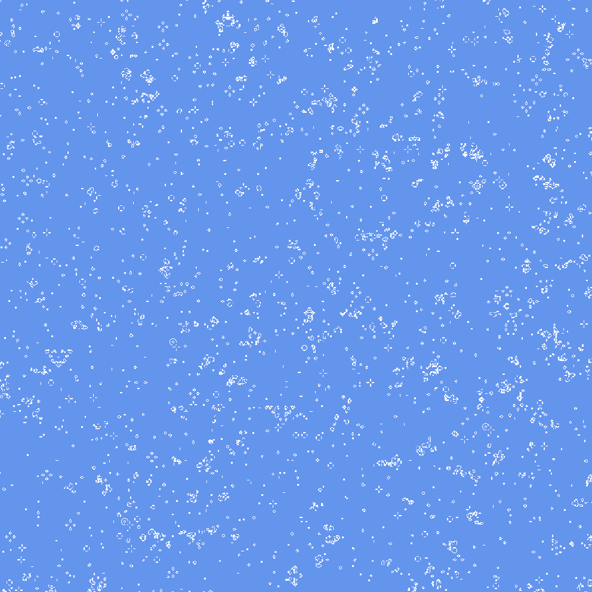

# Game of Life

Implementation of Conway's Game of Life in C#. 

This project is a baseline simulation with a naive implementation, serving as a foundation for performance-oriented experiments.

## Objectives

- Explore low-level simulation logic (cell state updates, neighborhood rules)
- Benchmark memory and CPU costs of large grids (up to 16 million cells)
- Iteratively implement optimizations (memory layout, multithreading, sparse updates)
- Serve as a sandbox to apply techniques from *Michael Abrash's Graphics Programming Black Book*

## Current features

- **Naive grid simulation** with update of all cells each frame
- **Double buffering** to separate read and write operations
- **Benchmark logging** for update/render timing
- **Simple 2D camera** (pan/zoom) and interactive mouse input

## Performance (4000x4000 grid size, 16M cells)

- **Naive implementation** (current): 110ms per logic update

## Optimizations to implement next

- **Bit-packed cell storage**: 1 bit for state + 3 bits to count how many neighbours are alive. 
- **Sparse update strategy**: keep a list of the cells whose state has changed in the last round and update only them and their neighbours (see if it's faster than a cache efficient linear traversal). 
- **Multithreading**
- **SIMD exploration**

## Sources

- *Michael Abrash's Graphics Programming Black Book*
